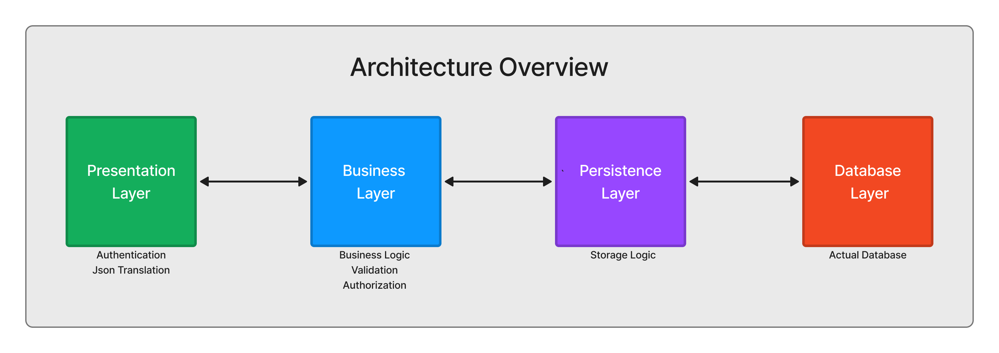
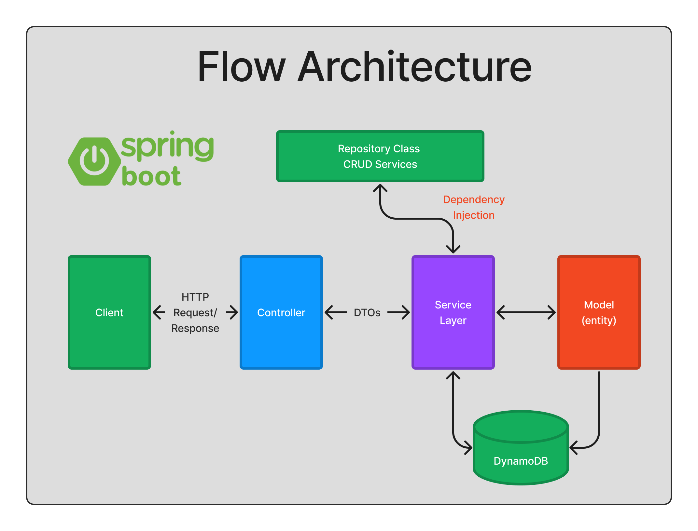

# Asylum RG BE

- A **search tool** to give a user-friendly view into a large dataset of asylum case decisions.
- Similar to [the TRAC database](https://trac.syr.edu/phptools/immigration/asylum/)—a popular existing tool, but with many limitations.
    - Generate a table of results, a real-time visualization of outcomes, and a real-time graph to represent what the trend looks like over time.
    - Show a heatmap where users can map out e.g., “Here are the 10 asylum regions with the highest or lowest grant rates.”
    - Need to be able to download search results.

### Tech Stack

- BE: Java + Spring
- DB: DynamoDB
- FE: React (JS)

BE Setup instructions can be found [**HERE**](https://www.notion.so/bloomtech/BE-Local-Setup-794f197185c046ccb9e2e9f073268cbe).

## Architectural Overview

## UML Diagrams
