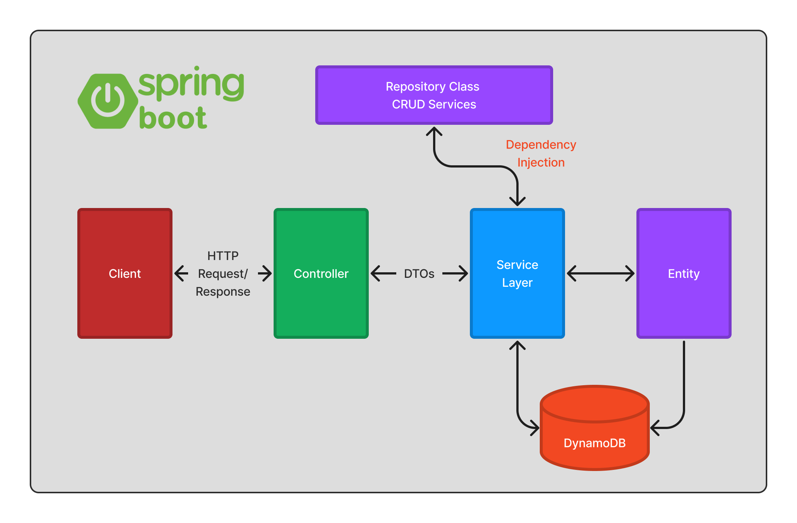
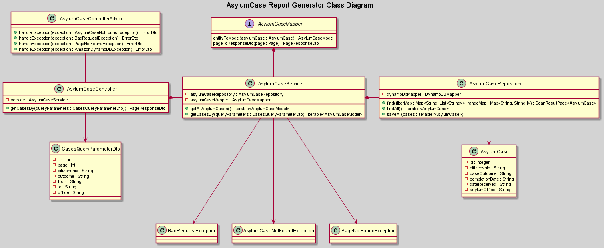

# Asylum RG BE

- A **search tool** to give a user-friendly view into a large dataset of asylum case decisions.
- Similar to [the TRAC database](https://trac.syr.edu/phptools/immigration/asylum/)—a popular existing tool, but with many limitations.
    - Generate a table of results, a real-time visualization of outcomes, and a real-time graph to represent what the trend looks like over time.
    - Show a heatmap where users can map out e.g., “Here are the 10 asylum regions with the highest or lowest grant rates.”
    - Need to be able to download search results.

### Tech Stack

- BE: Java + Spring Boot

- DB: DynamoDB

- FE: React (JS)

BE Setup instructions can be found [**HERE**](https://www.notion.so/bloomtech/BE-Local-Setup-794f197185c046ccb9e2e9f073268cbe).

## Backend Architectural Overview

(_Figure 1: Spring Boot layers_)

1. **Presentation Layer**: The top layer of Spring Boot architecture. It is used 
to convert incoming requests to Java Objects (Data Transfer Objects - DTOs) and vice-versa. It handles authentication and HTTP requests.
Once it performs the authentication of the request it passes it to the business layer for additional processing.

2. **Business Layer**: It manages all the business logic. It consists of services classes. It is responsible for 
validation and authorization. The Business layer communicates with both the Presentation layer and the Persistence 
Layer. We convert our DTO to our model within this layer.

3. **Persistence Layer**: It comprises all the storage logic, such as database questions. 
Additionally, it is responsible for converting business objects to the database row and vice-versa.
In other projects at BloomTech we called this the DAO.

4. **Database Layer**: It is simply the actual database. It can include many databases.

(_Figure 2: Spring Boot Flow Architecture_)

1. The Client makes an HTTP request.
2. The Controller class receives the HTTP request.
3. The Controller maps the request to a DTO.
4. If it is needed, it calls the service class.
5. The Service Class is going to handle the business logic. It does this on the data from the database (Entity class).
6. The Service Class passes a DTO to the Controller, and then we return a response.

Note: We are not using Spring Data or the Java Persistence Library(JPA)

##Implementation Notes
1. _Mapstruct conversion expanation placeholder_

## UML Diagrams
