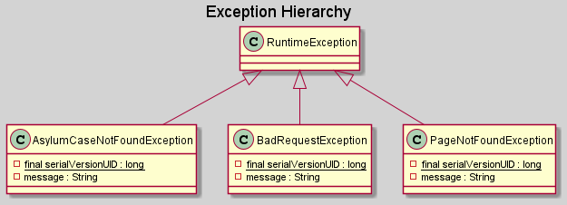
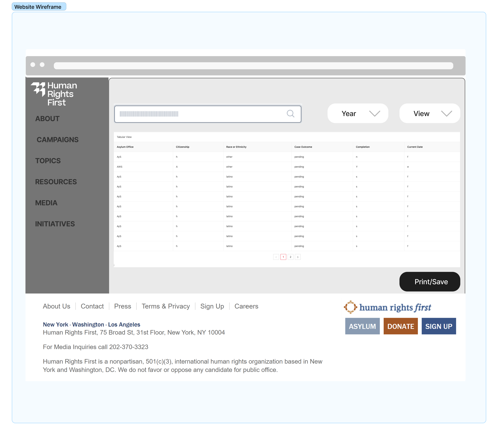
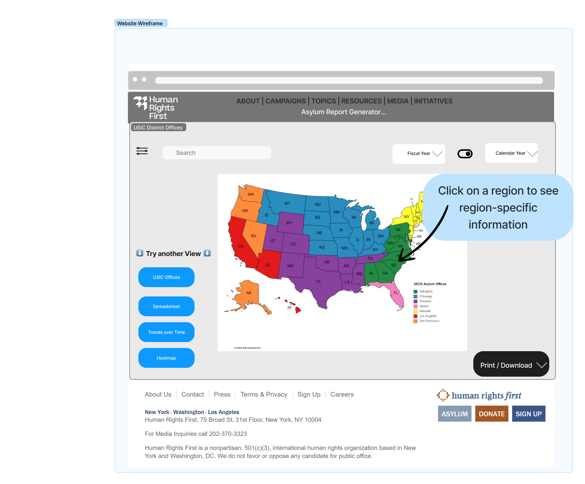
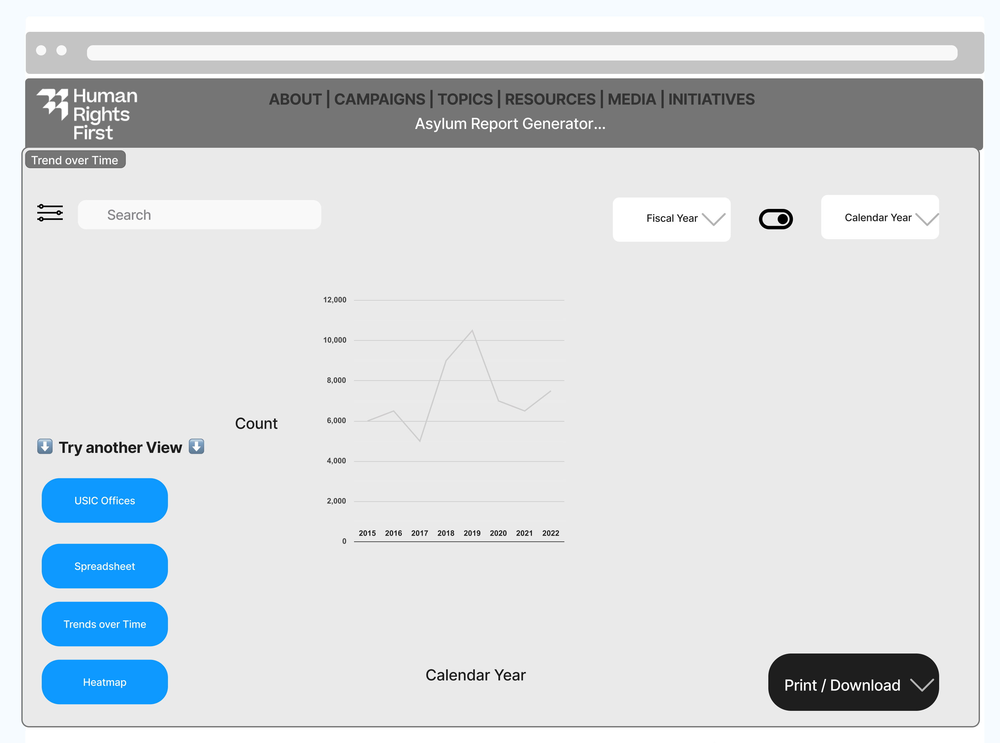

## Problem Statement
[Human Rights First (HRF)](https://www.humanrightsfirst.org/)   is an independent advocacy and
action organization that challenges America to live up
to its ideals. HRF is seeking a data search and
visualization tool to provide the public with a
user-friendly view into their large data set of asylum
case decisions. The concept is similar to the 
[TRAC database](https://trac.syr.edu/phptools/immigration/asylum/) —
a popular existing tool, but with a far more robust ability to select
and filter data.

This design document describes the HRF Asylum Report
Generator backend, a new service that will allow users
to view and filter decision data on multiple parameters,
generate visualizations, and download search results.

## General Use Cases
*For most up-to-date and detailed product requirements, please see Jira. This list is
intended to give an overall picture.*

* A user can generate a table of results, filtered by multiple parameters
* A user can generate a real-time graph to represent what trend looks
  like over time (Release 4)
* A user can generate a heatmap of asylum case outcomes (Release 5)
* A user can download the results of their search (Release 6)


## Project Scope

### Current scope
* Users can view all case data in a table
* Users can filter the dataset by one or more parameters


### Future Scope
* Users can create a heatmap of asylum case outcomes
* Users can create a heatmap of asylum case outcomes filtered
  by one or more parameters
* Use can generate a real-time graph to display a trend over time
* Users can download their search results

### Out of scope
* There is no user account, authentication, or log-in
* Users cannot modify data in the dataset (cannot add, update, or delete.)


## Learner Resources
This project extends the use of Spring Boot previously studied in the BD
curriculum. Previous BD learners have found these resources helpful in getting
up to speed:
* [Spring Book Workshop for BD led by Tom](https://www.youtube.com/watch?v=bQDvoqSSVpQ)
* [Spring Boot Cook Book](https://aveuiller.github.io/spring_boot_apprentice_cookbook.html)

This project makes use of Docker. Previous BD learners found this online tutorial, which is broken into chapters
helpful:
* [Docker tutorial](https://www.youtube.com/watch?v=3c-iBn73dDE)


## Backend Architectural Overview

(_Figure 1: Spring Boot layers_)

1. **Presentation Layer**: The top layer of Spring Boot architecture. It is used
   to convert incoming requests to Java Objects (Data Transfer Objects - DTOs) and vice-versa. It handles authentication and HTTP requests.
   Once it performs the authentication of the request it passes it to the business layer for additional processing.

2. **Business Layer**: It manages all the business logic. It consists of services classes. It is responsible for
   validation and authorization. The Business layer communicates with both the Presentation layer and the Persistence
   Layer. We convert our DTO to our model within this layer.

3. **Persistence Layer**: It comprises all the storage logic, such as database questions.
   Additionally, it is responsible for converting business objects to the database row and vice-versa.
   In other projects at BloomTech we called this the DAO.

4. **Database Layer**: It is simply the actual database. It can include many databases.


(_Figure 2: Spring Boot Flow Architecture_)

1. The Client makes an HTTP request.
2. The Controller class receives the HTTP request.
3. The Controller maps the request to a DTO.
4. The Controller calls the service class if it is needed.
5. The Service Class is going to handle the business logic. It does this on the data from the database (Entity class).
6. The Service Class passes a DTO to the Controller, and then we return a response.

Note: We are not using Spring Data or the Java Persistence Library(JPA)

## Implementation Notes
1. _Mapstruct conversion expanation placeholder_

## UML Diagrams




## API Documentation
The **Human Rights First: Asylum Report Generator** is a public REST API for retrieving records of government asylum
case data that has been provided for public use by Freedom of Information Act requests. The API currently only supports
`GET` method requests to a single endpoint `/cases` which retrieves asylum case records provided as `AsylumCaseModel`
objects encapsulated within a `PageResponseDto` object. There is no Authentication nor Authorization required to access
the API at this time.

### Data Models
As described above, the response to the `/cases` endpoint returns a `PageResponseDto` which is illustrated below in a
general JSON format. A `PageResponseDto` consists of two attributes. First, `totalPages` is an `Integer` representing
the total number of pages of asylum cases that match the query parameters. Second, `page` is the `Iterable` collection
containing a given number of asylum cases that match the criteria provided in the query parameters, encapsulated in
`AsylumCaseModel` objects. The amount of cases and which cases are returned is based on the `limit` and `page` query
parameters.

```
PageResponseDto {
    "totalPages": Number,
    "page": [
        AsylumCaseModel {
            "citizenship": "String",
            "caseOutcome": "String",
            "completionDate": "yyyy-MM-dd",
            "asylumOffice": "String"
        }
    ]
}
```

In the instance that no asylum cases can be found, such as providing a combination of query parameters that leads to
an empty result or providing invalid query parameter values, an `ErrorDto` will be returned with a specific message
describing the error.

```
ErrorDto {
    "message": "String"
}
```

### Query Parameters

The table below describes the different query parameters that can be appended to the `GET` request to narrow and refine
the returned data by one or more attributes. Multiple values can be provided for the `citizenship` category insofar as
the values are delimited by a zero character; the `outcome` and `office` categories can also have multiple values
insofar as the values are delimited by a comma character.

The `from` and `to` categories are parameters to filter for ranges of dates, specifically the completion date. Providing
only the `from` parameter will filter dates **from** the floor. Providing only the `to` parameter will filter dates
**to** the ceiling, inclusive. When providing both categories, a range will be formed between the `from` and `to` values
inclusive.

| Filtering Parameter                  | Parameter Description                                                                          |
|-----------------------------------|------------------------------------------------------------------------------------------------|
| **limit** (Integer)                   | The maximum number of asylum cases to populate per page (minimum value of 1)                   |
| **page**	(Integer)                   | The page number to access in the returned pages (minimum value of 1)                        |
| **citizenship** (String, 0-delimited) | The asylum case petitioners nation of origin, per their birth record                           |
| **outcome** (String, comma-delimited) | The asylum case result (Admin Close/Dismissal, Deny/Referral, Grant)                           |
| **from**	(ISO-8061 yyyy-MM-dd)       | The minimum completion date to include (floor)                                          |
| **to** (ISO-8061 yyyy-MM-dd)          | The maximum completion date to include (ceiling)                                              |
| **office** (String, comma-delimited)  | The three letter String representing the US Asylum Office district in which the case was heard |

## Example `/cases` Endpoint `GET` Calls using Limit and Page Parameters

A `GET` request is made to the `/cases` endpoint without any filtering parameters. All asylum cases will be returned with
a default `limit` value of 10 and a default `page` value of 1. In this example there are 13 entries within the database.

```
http://localhost:8080/cases
```
```
{
    "totalPages": 2,
    "page": [
        {
            "citizenship": "CHINA, PEOPLE'S REPUBLIC OF",
            "caseOutcome": "Deny/Referral",
            "completionDate": "2018-10-18",
            "asylumOffice": "ZLA"
        }
        {
            "citizenship": "ARMENIA",
            "caseOutcome": "Admin Close/Dismissal",
            "completionDate": "2017-3-7",
            "asylumOffice": "ZSF"
        }
        
        ...
        
        {
            "citizenship": "CHINA, PEOPLE'S REPUBLIC OF",
            "caseOutcome": "Deny/Referral",
            "completionDate": "2018-10-18",
            "asylumOffice": "ZLA"
        }
    ]
}
```

Following the previous example, a `GET` request is made to the `/cases` endpoint with a `limit` value of 5 and a `page`
value of 2 with no other query parameters or filtering criteria. In this case, pages of 5 asylum cases will be
generated and the second page of the results will be returned, following the same assumption of 13 entries in the
database.
```
http://localhost:8080/cases?limit=5&page=2
```
```
{
    "totalPages": 3,
    "page": [
        {
            "citizenship": "RUSSIA",
            "caseOutcome": "Deny/Referral",
            "completionDate": "2018-10-18",
            "asylumOffice": "ZLA"
        }
        {
            "citizenship": "ARMENIA",
            "caseOutcome": "Admin Close/Dismissal",
            "completionDate": "2017-3-7",
            "asylumOffice": "ZSF"
        } 
        
        ...
        
        {
            "citizenship": "CHINA, PEOPLE'S REPUBLIC OF",
            "caseOutcome": "Deny/Referral",
            "completionDate": "2018-10-18",
            "asylumOffice": "ZLA"
        }
    ]
}
```

However, if the requested `page` number exceeds the number of possible pages based on the parameters of the request,
then an `ErrorDto` will be returned with a message describing the cause. In this case where the provided `page` is 5 and
the previous assumptions remain the same, the error message will specify that the client is attempting to reach an
unreachable page as there are only 3 possible pages given those parameters.
```
http://localhost:8080/cases?limit=5&page=5
```
```
{
    "message": "Error: No pages left to access..."
}
```

## Example `/cases` Endpoint `GET` Calls using Filtering Parameters

A `GET` request is made to the `/cases` endpoint with a single filtering parameter, a `citizenship` value of `RUSSIA`,
so only asylum cases with a citizenship value of Russia will be returned.  In this example there are only three asylum
cases with a citizenship value of Russia in the database.
```
http://localhost:8080/cases?citizenship=RUSSIA
```

```
{
    "totalPages": 1,
    "page": [
        {
            "citizenship": "RUSSIA",
            "caseOutcome": "Deny/Referral",
            "completionDate": "2018-10-18",
            "asylumOffice": "ZLA"
        }
        {
            "citizenship": "RUSSIA",
            "caseOutcome": "Deny/Referral",
            "completionDate": "2017-3-7",
            "asylumOffice": "ZSF"
        }    
        {
            "citizenship": "RUSSIA",
            "caseOutcome": "Deny/Referral",
            "completionDate": "2018-10-18",
            "asylumOffice": "ZLA"
        }
    ]
}
```
Following the previous example, a `GET` request is made to the `/cases` endpoint with a single filtering parameter:
a `citizenship` value of `RUSSIA0ARMENIA.` In this case, all asylum cases with the citizenship value of Russia or
Armenia will be returned. As before, there are only 3 asylum cases with a citizenship value of Russia and 1 asylum case
with a citizenship value of Armenia in the database.

```
http://localhost:8080/cases?citizenship=RUSSIA0AREMENIA
```

```
{
    "totalPages": 1,
    "page": [
        {
            "citizenship": "RUSSIA",
            "caseOutcome": "Deny/Referral",
            "completionDate": "2018-10-18",
            "asylumOffice": "ZLA"
        }
        {
            "citizenship": "RUSSIA",
            "caseOutcome": "Deny/Referral",
            "completionDate": "2017-3-7",
            "asylumOffice": "ZSF"
        }    
        {
            "citizenship": "RUSSIA",
            "caseOutcome": "Deny/Referral",
            "completionDate": "2018-10-18",
            "asylumOffice": "ZLA"
        }
        {
            "citizenship": "ARMENIA",
            "caseOutcome": "Admin Close/Dismissal",
            "completionDate": "2017-3-7",
            "asylumOffice": "ZSF"
        }
    ]
}
```

However, a `GET` request  made to the `/cases` endpoint with two filtering parameters, `outcome` with a value of `Grant`
and `citizenship` with a value of `RUSSIA`, will result in an `ErrorDto.` Notice that in the previous examples, all the
asylum cases with citizenship value of Russia also had an outcome value of Deny/Referral.

```
http://localhost:8080/cases?citizenship=RUSSIA&outcome=Grant
```

```
{
    "message": "ERROR: No cases were found..."
}
```

## Example `/cases` Endpoint `GET` Calls using Range Filtering Parameters

A `GET` request is made to the `/cases` endpoint with two filtering parameters: `citizenship` with a value of
`RUSSIA0ARMENIA` and `from` with a value of `2018-01-01`. In this case, only asylum cases with a citizenship value of
Russia or Armenia and with a completion date on or after January 1st, 2018 will be returned. Notice the completion
dates from the previous example.

```
http://localhost:8080/cases?citizenship=RUSSIA0AREMENIA&from=2018-01-01
```

```
{
    "totalPages": 1,
    "page": [
        {
            "citizenship": "RUSSIA",
            "caseOutcome": "Deny/Referral",
            "completionDate": "2018-10-18",
            "asylumOffice": "ZLA"
        } 
        {
            "citizenship": "RUSSIA",
            "caseOutcome": "Deny/Referral",
            "completionDate": "2018-10-18",
            "asylumOffice": "ZLA"
        }
    ]
}
```

A `GET` request is made to the `/cases` endpoint with two filtering parameters: `citizenship` with a value of
`RUSSIA0ARMENIA` and `to` with a value of `2018-01-01`. In this case, all asylum cases with the citizenship value of
Russia or Armenia will be returned with a completion date on or prior to January 1st of 2018. Notice the completion
dates from the previous example.

```
http://localhost:8080/cases?citizenship=RUSSIA0AREMENIA&to=2018-01-01
```

```
{
    "totalPages": 1,
    "page": [
        {
            "citizenship": "RUSSIA",
            "caseOutcome": "Deny/Referral",
            "completionDate": "2017-3-7",
            "asylumOffice": "ZSF"
        }    
        {
            "citizenship": "ARMENIA",
            "caseOutcome": "Admin Close/Dismissal",
            "completionDate": "2017-3-7",
            "asylumOffice": "ZSF"
        }
    ]
}
```

Finally, a `GET` request is made to the `/cases` endpoint with three filtering parameters: `citizenship` with a value of
`RUSSIA0ARMENIA`, `from` with a value of `2018-01-01`, and finally `to` with a value of `2018-09-01`. In this case, an
`ErrorDto` will be returned as there are no asylum cases with a citizenship value of Russia or Armenia and a completion
date between January 1st of 2018 to September 1st of 2018. Notice the completion dates of the previous examples.

```
http://localhost:8080/cases?citizenship=RUSSIA0AREMENIA&from=2018-01-01&to=2018-09-01
```
```
{
    "message": "ERROR: No cases were found..."
}
```

### Cases Endpoint Sequence Diagram


## Frontend Integration

### Pages

#### Viewing Case Data

*Current Release*
[Figma Link](https://www.figma.com/file/zrTsnUUki4RsARx5GqFHBR/Viewing-Case-Data?node-id=0%3A1)

<br/>

#### Visualization Outcome Breakdown
{Placeholder for future feature}<br/>
*Feature - Outcome Breakdown*
[Figma Link](link placeholder)

<br/>

#### Visualization Trends
{Placeholder for future feature}<br/>
*Release 4*
[Figma Link](link placeholder)

<br/>

#### Visualization Heatmap
{Placeholder for future feature}<br/>
*Release 5*
[Figma Link](link placeholder)

<br/>

#### Export
{Placeholder for future feature}<br/>
*Release 6*
[Figma Link](link placeholder)

<br/>

### Wireframe

[Figma Link](https://www.figma.com/file/WmbwFYQDSIDnZyemR3OVv8/HRF-ARG-WireFrame?node-id=0%3A1)

<br/>

#### Desktop Initial Screen

*Feature - View Case Data*

<br/>

#### Desktop District Offices

*Feature - Outcome Breakdown*

<br/>

#### Desktop Trend Over Time

*Release 4*

<br/>

#### Desktop Heatmap

*Release 5*

<br/>

#### Desktop Spreadsheet

*Release 6*

