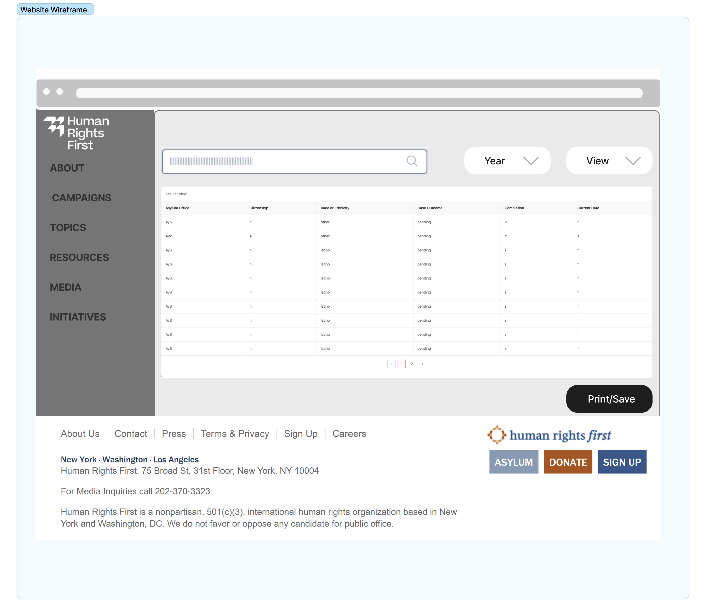
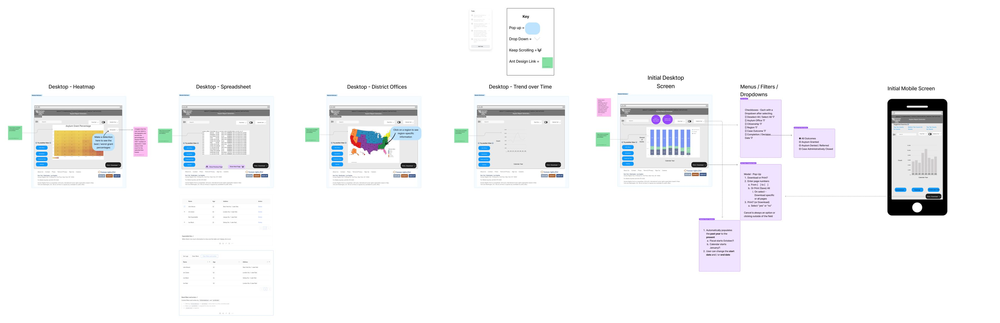
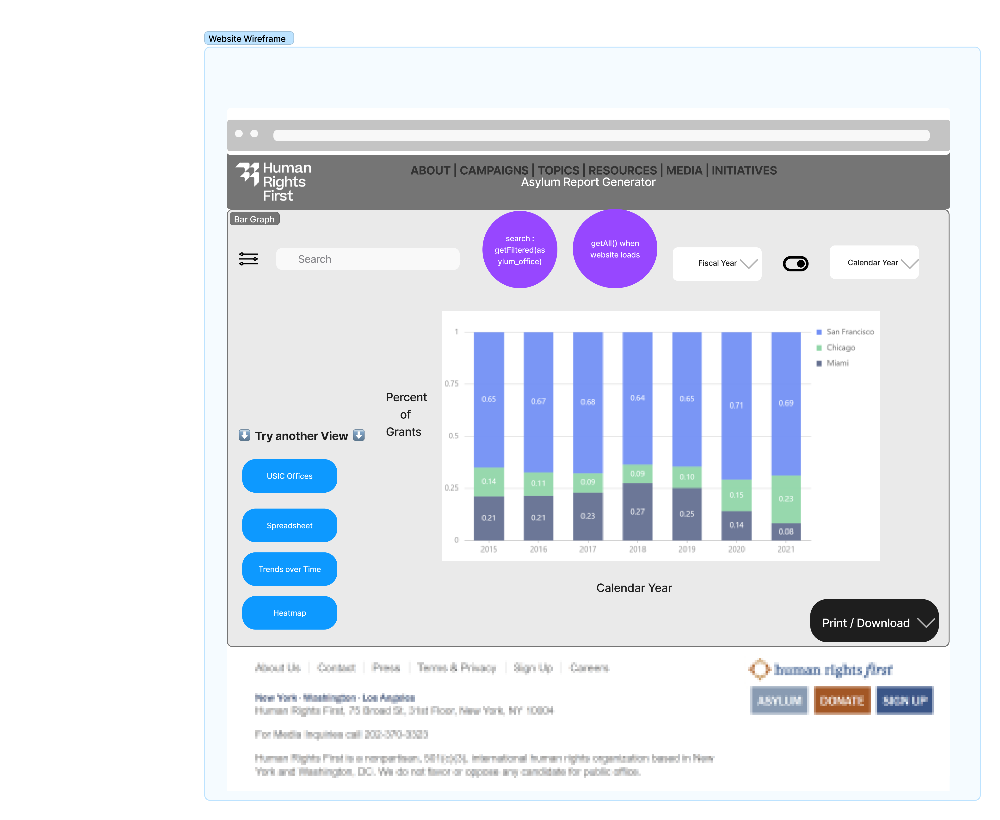
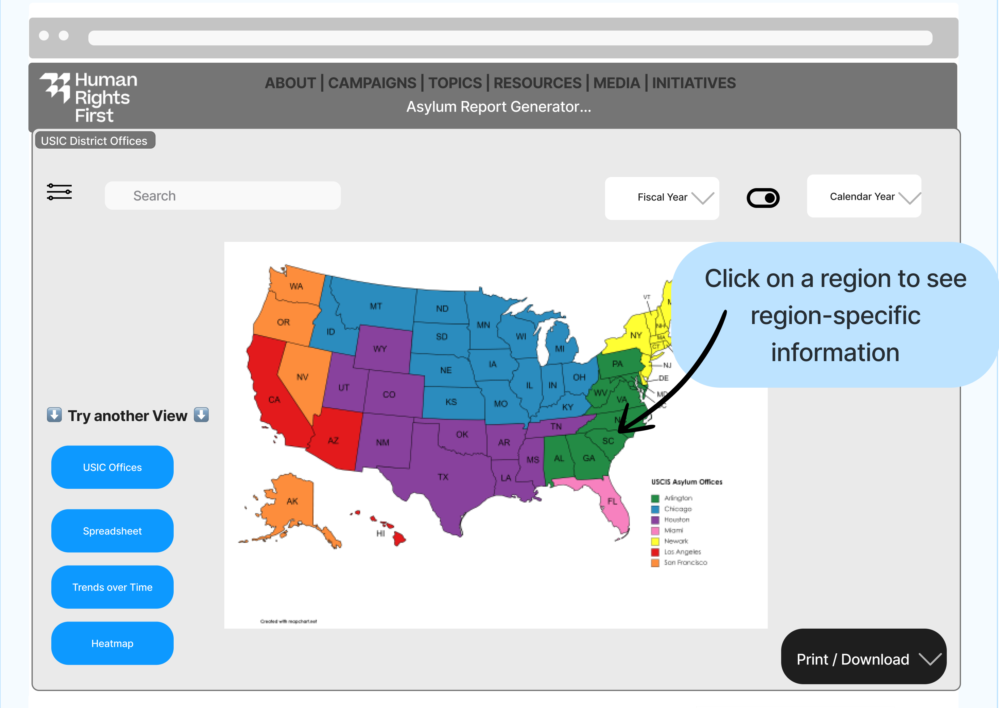
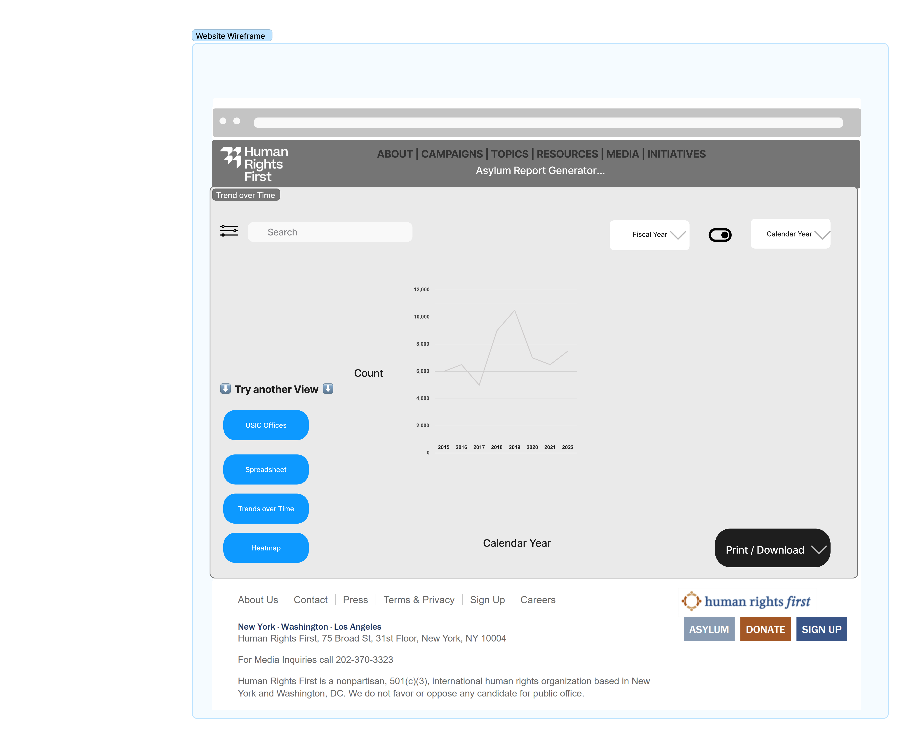
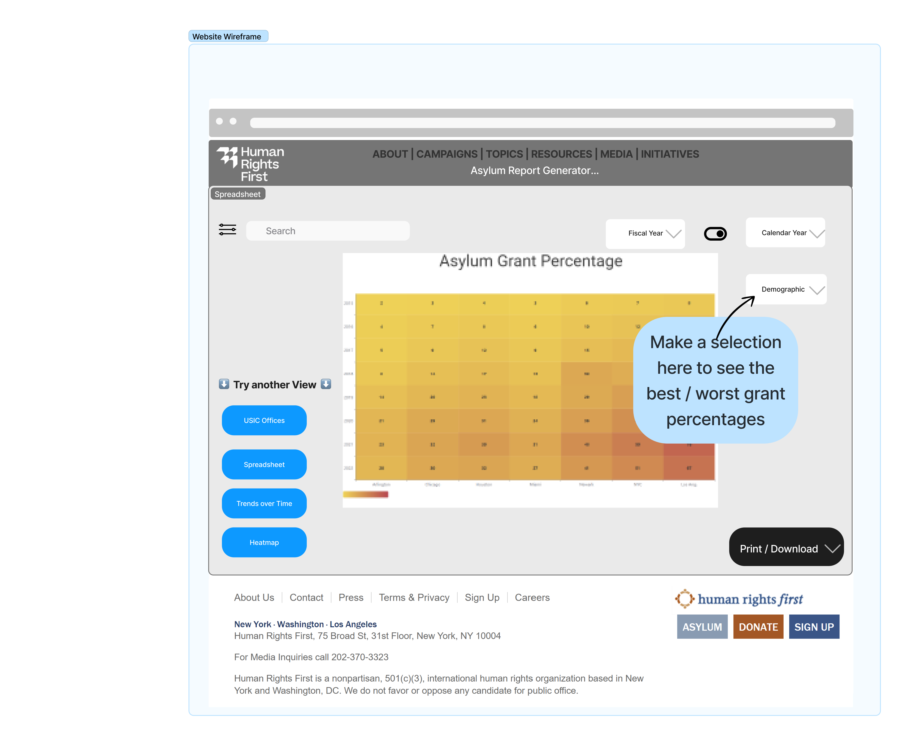

## Frontend Integration

### Pages
#### Viewing Case Data

*Current Release*
[Figma Link](https://www.figma.com/file/zrTsnUUki4RsARx5GqFHBR/Viewing-Case-Data?node-id=0%3A1)

### Wireframe

[Figma Link](https://www.figma.com/file/WmbwFYQDSIDnZyemR3OVv8/HRF-ARG-WireFrame?node-id=0%3A1)

#### Desktop Initial Screen

*Current Release*

#### Desktop District Offices

*Feature - Outcome Breakdown*

#### Desktop Trend Over Time

*Release 4*

#### Desktop Heatmap

*Release 5*

#### Desktop Spreadsheet

*Release 6*

